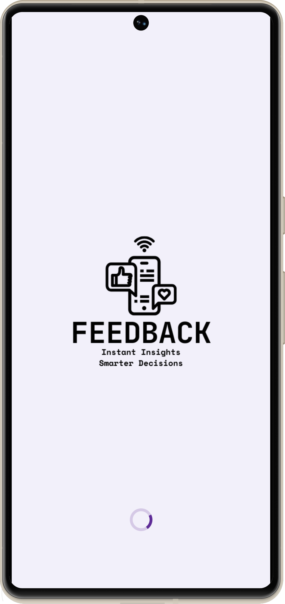
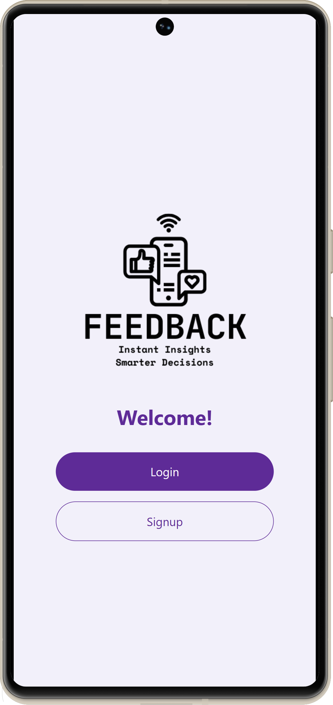
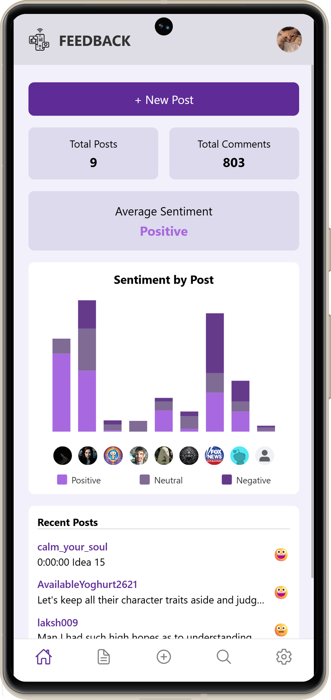
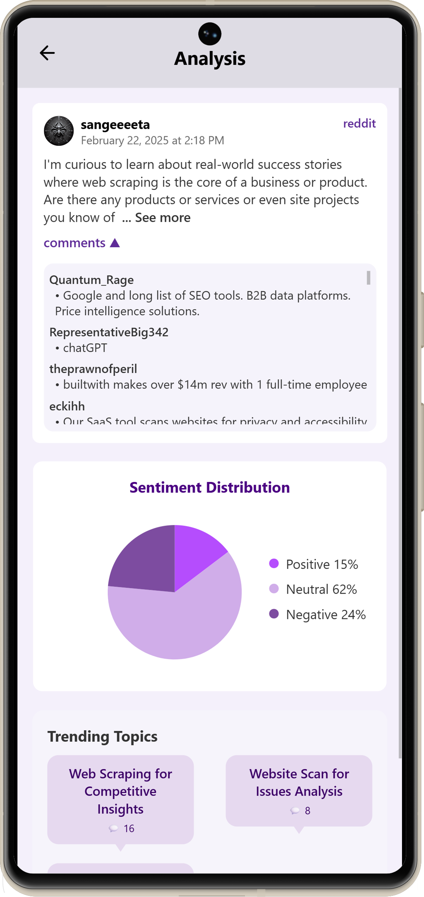

# Feedback — End of Study Project

Feedback Analyzer is a mobile application that analyzes a single social media post at a time for **sentiment** and **topic modeling**.  
It uses AI models, a FastAPI backend, and a React Native frontend (Expo) to provide insights on user comments and posts.

---

## App Screens

<p align="center">
  
  
  
  
  
</p>

<p align="center">
  <a href="frontend/assets/screens/">
    ➕ View all screens
  </a>
</p>

---


## Features

- Sentiment analysis: Positive / Negative / Neutral  
- Topic modeling: Extract main discussion topics per post  
- Multi-platform support: Facebook, Instagram, Reddit, StackExchange, YouTube  
- Local execution with rate-limits  

---

## Getting Started

### 1. Clone the repository
```bash
git clone https://github.com/yourusername/feedback.git
cd feedback
```

### 2. Backend setup
```bash
cd backend
python -m venv .venv
.venv\Scripts\activate
pip install -r requirements.txt
uvicorn app.main:app --reload
```
### 3. Frontend setup
```bash
cd frontend
npm install
expo start
```

##Usage

1- Run the backend API   
2- Open the frontend app in Expo    
3- Add a post URL in the app and analyze its comments   
4- View sentiment results and extracted topics
